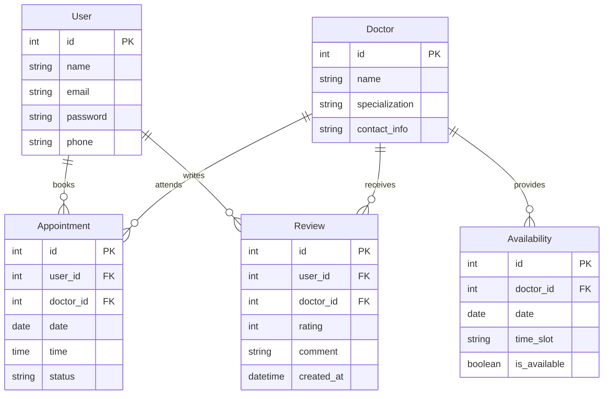

# 🩺 GP Booking App

## 🌟 Overview and Project Goals

The **GP Booking App** is a modern, user-friendly appointment scheduling platform tailored for individual general practitioners. Rather than being a generic multi-provider solution, this app is custom-branded for each doctor, giving them full ownership and a direct connection with their patients.

Our goals for this project:
- ✅ Simplify appointment scheduling for both doctors and patients.
- ✅ Build a scalable solution that can be sold as a white-labeled product to other GPs.
- ✅ Enhance the digital presence of local healthcare providers.
- ✅ Provide a seamless experience across both web and mobile platforms.
- ✅ Ensure the application is secure, responsive, and easy to maintain.

---

## 🛠️ Tech Stack

The project is built using modern, scalable technologies for both the frontend and backend to ensure performance, maintainability, and developer productivity.

### Frontend

- **React.js** – JavaScript library for building user interfaces. Provides a fast, component-based architecture for dynamic content rendering.
- **React Router** – Handles client-side routing, allowing seamless navigation between pages without full page reloads.
- **Axios** – HTTP client used to communicate with the backend API.
- **CSS Modules / Tailwind CSS (optional)** – Scoped and reusable styling options for creating a clean, professional UI.

### Backend

- **Node.js** – JavaScript runtime used for executing server-side code.
- **Express.js** – Fast and lightweight web application framework for Node.js to build the RESTful API.
- **dotenv** – Loads environment variables from a `.env` file into `process.env`.
- **cors** – Middleware to enable Cross-Origin Resource Sharing between client and server.
- **nodemon** – Development tool that automatically restarts the server on code changes.

### Development & Deployment Tools

- **VS Code** – Code editor with built-in Git, debugging, and extensions for productivity.
- **Git & GitHub** – Version control and remote repository for collaborative development.
- **npm** – Node package manager used to manage project dependencies.

---

## 🧩 Database Design

The backend relies on a relational database designed to store and manage data efficiently for the GP Booking App. The structure supports scalability and maintains data integrity across different use cases.

### 📦 Entities and Relationships

The system uses several core entities connected via foreign key relationships:

- **User** – Represents patients who use the app to book appointments.
- **Doctor** – Represents the GP (General Practitioner) whose appointments are being booked. Each app instance is tied to a single doctor.
- **Appointment** – Stores scheduled bookings between a user and the GP.
- **Review** – Captures user feedback after appointments.
- **Availability** – Represents time slots during which the GP is available.
- **MedicalRecord** *(optional/advanced)* – Stores additional patient history or uploaded files if needed in the future.

---

### 🧩 ERD Overview

---

### 📅 Booking System

- Users can view available time slots based on the GP's availability.
- Bookings are stored with timestamps, status (pending/confirmed/cancelled), and linked to both the user and doctor.

---

### ⭐ Reviews

- After appointments, users can leave reviews.
- Reviews include ratings, comments, and timestamps.
- Only users with past bookings can submit a review (to ensure trust and relevance).

---

### 🕐 Availability

- The GP can set available dates and time slots in advance.
- The system dynamically hides past dates and prevents double booking.

---

### 🔗 Entity Relationship Summary

This application is designed for a **single general practitioner (GP)** to manage bookings with patients. The system centers around the interaction between **Users (patients)** and the **GP**, with features for scheduling appointments and providing feedback. Here’s how the entities relate:

- **User ↔ Appointment**:  
  A user (patient) can book multiple appointments, but each appointment is tied to a specific user. This forms a **one-to-many** relationship.

- **Appointment ↔ Availability**:  
  Each appointment is scheduled within a predefined availability slot. The GP creates multiple availability time slots. This forms a **many-to-one** relationship from appointment to availability.

- **User ↔ Review**:  
  After an appointment, a user may submit one review. This is a **one-to-one**

- **GP (Singleton)**:  
  The general practitioner entity is implied and does not vary — the system assumes all interactions are with the owner of the app.

---

## 🚀 Features

Here are the core features implemented in the GP Booking App:

### 🧑‍⚕️ General Practitioner Dashboard
- View daily, weekly, and monthly appointment schedules.
- Manage availability slots (add, update, delete).
- See patient details for upcoming appointments.
- Access patient reviews and feedback.

### 👥 User (Patient) Features
- Register and log in securely.
- Book appointments based on available time slots.
- View upcoming and past appointments.
- Leave reviews after consultation.

### 📅 Appointment Management
- Real-time availability to prevent double bookings.
- Automatic removal of expired slots from availability.
- Email and SMS confirmation for bookings.

### ⭐ Review System
- Users can provide feedback after appointments.
- GP can monitor and address patient satisfaction.

### 🔐 Authentication and Security
- Secure user authentication using hashed passwords and session management.
- Role-based access for GP and users (coming soon).

### 🛠️ Admin Customization (White-Label Ready)
- Branding support (custom name, logo, and colors for each GP).
- Modular structure for easy adaptation and deployment per client.

### 📱 Responsive Design
- Fully mobile-friendly for both GP and patients.
- Can be deployed as a **Progressive Web App (PWA)** for mobile-like experience.

### 🧪 Developer Friendly
- RESTful API with clear endpoints for appointments, users, availability, and reviews.
- Well-organized codebase with separate folders for client and server.

---
## 🔐 API Security

To ensure safe and secure communication between the client and server, the GP Booking App implements several API-level security measures:

### 1. **Environment-Based Secrets**
- Sensitive configurations such as database credentials and server secrets are stored in a `.env` file and never exposed in the source code.
- `dotenv` is used to load environment variables securely.

### 2. **CORS Policy**
- Cross-Origin Resource Sharing (CORS) is configured using the `cors` middleware to allow only trusted frontend origins to interact with the API.

### 3. **Input Validation & Sanitization**
- Incoming data is validated and sanitized on both frontend and backend to prevent injection attacks like XSS and SQL Injection.

### 4. **Authentication & Authorization**
- JSON Web Tokens (JWT) or session-based authentication (to be implemented).
- Role-based access control to restrict API endpoints based on user roles (GP vs Patient).

### 5. **Rate Limiting & Throttling** *(Future Feature)*
- Planned implementation to prevent brute-force and denial-of-service attacks by limiting the number of requests per user/IP.

### 6. **HTTPS Recommended**
- For production, the application is designed to be served over **HTTPS** to encrypt all client-server communication.

> 🚧 Note: Some security layers (like JWT, rate limiting, etc.) are part of upcoming improvements in future iterations.

---

## 🚀 CI/CD Pipeline

The GP Booking App follows a modern Continuous Integration and Continuous Deployment (CI/CD) pipeline to ensure high-quality code and seamless delivery.

### 🧪 Continuous Integration (CI)

CI is responsible for automatically testing and validating code before it is merged into the main branch:

- **GitHub Actions** is used as the CI engine.
- Linting and formatting checks using ESLint and Prettier.
- Automated unit testing (to be implemented).
- Pull Request checks before merge.
- Branch protection rules ensure stable codebase.

### 🚀 Continuous Deployment (CD)

The CD process automates deployment from the main branch to the hosting platform.

- **Frontend Deployment:** Hosted on **Vercel** or **Netlify**. Automatically redeploys on changes to the `client/` directory.
- **Backend Deployment:** Hosted on **Render** or **Railway**, triggered by commits to the `server/` directory.
- Environment variables are managed securely via the deployment dashboard (Vercel, Render, etc.).

### 🔁 Workflow Summary

1. Developer pushes code to GitHub.
2. GitHub Actions run linting, tests, and build checks.
3. On success, the app is auto-deployed to the chosen platform.
4. Deployment logs and status updates are monitored.

> ✅ This CI/CD pipeline ensures that new features and bug fixes are delivered efficiently with minimal downtime.

---

## 📌 Importance of the Project

In today's fast-paced digital world, access to healthcare needs to be more streamlined, efficient, and accessible. The **GP Booking App** addresses this need by providing a simple yet powerful platform for managing patient-doctor appointments with minimal friction.

### ✅ Why This Project Matters:

- **Empowers Solo Practitioners:** Unlike multi-doctor booking platforms, this app is built specifically for **independent general practitioners**, enabling them to digitize operations without competing on shared platforms.

- **Reduces Administrative Burden:** Automates scheduling, reduces back-and-forth calls, and minimizes no-shows through reminders and confirmations.

- **Enhances Patient Experience:** Patients can easily find available time slots, book appointments, and receive automated notifications—creating a smoother and more satisfying experience.

- **Future-Ready Infrastructure:** Designed with scalability in mind, allowing for features like online consultations, e-prescriptions, and analytics to be added down the line.

- **Supports Local Communities:** Ideal for smaller practices in underserved or rural areas to bridge the digital gap in healthcare services.

---

> This project is more than just code—it's a real-world solution to modernize solo healthcare practices and improve the well-being of both patients and doctors.
